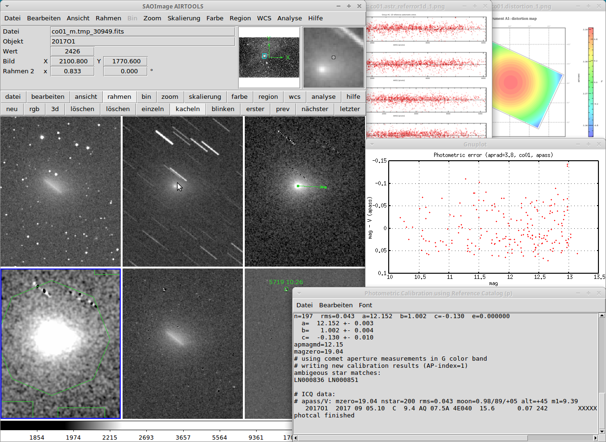

# Astronomical Image Reduction TOOLSet

AIRTOOLS is a collection of programs to aim at astronomical image reduction
of both CCD and DSLR observations on Linux. The main tasks are implemented as
shell functions (bash) in a file airfun.sh. These functions are build
around many tools readily available on most Linux desktops, including
ImageMagick, GraphicsMagick, Netpbm, WCSTools, Gnuplot.

The primary intention of the airtools software is the photometric analysis
of comet observations. New procedures were developed to measure the total coma
brightness. Those image processing steps are easily accessible by means of
analysis tasks in the SAOImage display GUI.

The underlying shell functions make use of powerful third party software
commonly used in professional astronomy:
- [SAOImage DS9](http://ds9.si.edu/site/Home.html): image display, catalog
  viewer and analysis GUI
- [Astromatic software](http://www.astromatic.net) by E.Bertin: automatic source
  detection (sextractor), astrometric calibration (scamp), stacking (swarp),
  modeling (skymaker) and more
- [Stilts](http://www.starlink.ac.uk/stilts/) by M. Taylor: powerful table
  processing
- [Cexamples](http://heasarc.gsfc.nasa.gov/docs/software/fitsio/cexamples.html):
  basic FITS routines

**NEW** A [german user manual](doc/manual-de.md) has been added recently. It
covers all aspects from installation to using the provided AIRTOOLS tasks for
comet photometry.

Users which do not speak german can use the following documentation
- [README.Windows](doc/README.Windows.md): which has instructions on preparing
  a computer running Windows operating system or MacOS X
- [INSTALL](INSTALL.md): Installation instructions for the AIRTOOLS software
- [GettingStarted](doc/GettingStarted.txt) text file for
  basic information on how to start AIRTOOLS tasks after installation.
