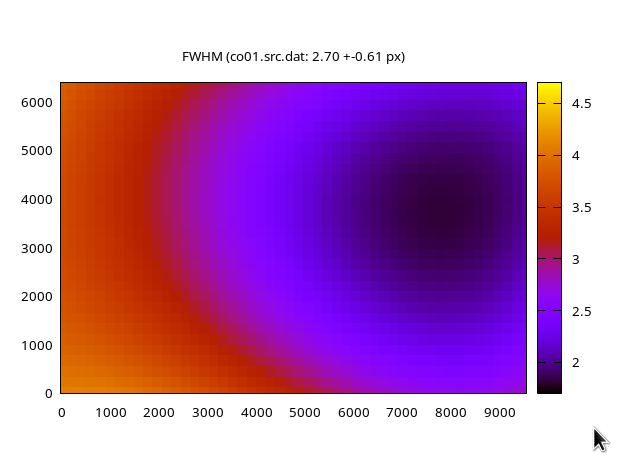
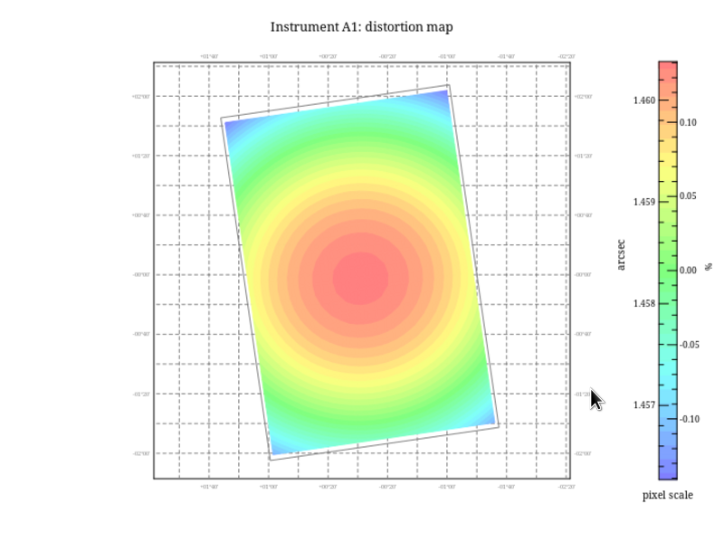

Astronomical Image Reduction and Comet Photometry with AIRTOOLS (v5.1)
======================================================================

---
author:
- Thomas Lehmann
date: Draft, May 2024
title: Astronomical Image Reduction and Comet Photometry with AIRTOOLS
  (v5.1)
---

-   [1
    Introduction](#introduction)
-   [2
    Installation](#installation)
    -   [2.1 Installation on
        Linux](#installation-on-linux)
        -   [2.1.1 Installing
            the AIRTOOLS software](#installing-the-airtools-software)
        -   [2.1.2 Updating the
            AIRTOOLS software](#updating-the-airtools-software)
        -   [2.1.3 Uninstalling
            the AIRTOOLS software](#uninstalling-the-airtools-software)
    -   [2.2 Installation on
        Windows using a Linux/AIRTOOLS
        appliance](#installation-on-windows-using-a-linuxairtools-appliance)
        -   [2.2.1 Installing
            Oracle VirtualBox](#installing-oracle-virtualbox)
        -   [2.2.2 Importing the
            Linux/AIRTOOLS
            appliance](#importing-the-linuxairtools-appliance)
        -   [2.2.3 Starting the
            virtual Linux OS](#starting-the-virtual-linux-os)
        -   [2.2.4 Xubuntu
            Desktop Basics](#xubuntu-desktop-basics)
-   [3 The AIRTOOLS Graphical
    User Interface](#the-airtools-graphical-user-interface)
-   [4 The first AIRTOOLS
    Project](#the-first-airtools-project)
    -   [4.1 What is a
        Project?](#what-is-a-project)
    -   [4.2 Setting up the
        AIRTOOLS software](#setting-up-the-airtools-software)
    -   [4.3 Setting up the
        first Project](#setting-up-the-first-project)
    -   [4.4 Parameter
        Files](#parameter-files)
    -   [4.5 Raw
        Images](#raw-images)
    -   [4.6 Image orientation,
        flip status and Bayer pattern](#image_orientation)
    -   [4.7 Image Set
        Definition](#image-set-definition)
-   [5 Image
    Reduction](#image-reduction)
    -   [5.1 Master Darks and
        Flats](#master-darks-and-flats)
    -   [5.2 Bad Pixel
        Masks](#bad-pixel-masks)
    -   [5.3 Image
        Calibration](#image-calibration)
    -   [5.4 Background
        evaluation](#background-evaluation)
    -   [5.5 Image
        Registration](#image-registration)
    -   [5.6 Stacking and
        Astrometric calibration](#stacking-and-astrometric-calibration)
-   [6 Large Aperture Comet
    Photometry](#large-aperture-comet-photometry)
    -   [6.1 Comet
        Observation](#comet-observation)
    -   [6.2 Background Gradient
        Removal](#background-gradient-removal)
    -   [6.3 PSF Extraction and
        Star Removal](#psf-extraction-and-star-removal)
    -   [6.4 Comet Extraction
        and Measuring the
        Comet](#comet-extraction-and-measuring-the-comet)
    -   [6.5 Photometric
        Calibration](#photometric-calibration)
-   [7 Appendix](#appendix)
    -   [7.1 Custom Installation
        on Windows](#custom-installation-on-windows)
        -   [7.1.1 Setup of a
            Virtual Machine for the Linux
            OS](#setup-of-a-virtual-machine-for-the-linux-os)
        -   [7.1.2 Booting
            Install Medium of the Xubuntu Linux
            distribution](#booting-install-medium-of-the-xubuntu-linux-distribution)
        -   [7.1.3 Installing
            Xubuntu Linux](#installing-xubuntu-linux)
        -   [7.1.4 Xubuntu
            Desktop Basics](#xubuntu-desktop-basics-1)
        -   [7.1.5 Installing
            VirtualBox Guest
            Additions](#installing-virtualbox-guest-additions)
        -   [7.1.6 Installing
            the AIRTOOLS software](#installing-the-airtools-software-1)
    -   [7.2 Sample data
        project](#sample-data-project)
        -   [7.2.1 Create
            project](#create-project)
        -   [7.2.2 Get
            observations data files](#get-observations-data-files)
        -   [7.2.3 Image
            reduction](#image-reduction-1)
        -   [7.2.4 SAOImage
            display](#saoimage-display)
        -   [7.2.5 Comet
            Photometry](#comet-photometry)
    -   [7.3 Using external USB
        storage](#using-external-usb-storage)

# Introduction

The AIRTOOLS software - or **A**stronomical **I**mage **R**eduction
**TOOLS**et - has been developed for the purpose of calibrating and
analyzing images of astronomical objects captured by CCD or DSLR
cameras. The software provides a large number of functions for basic
image calibration (e.g. bias-, dark-, flatfield calibration, raw
development of bayered images), for automated object recognition,
registration and stacking as well as automated astrometric and
photometric calibration routines.

Moreover specialized tools have been developed to process comet
observations and measure the total coma brightness at an accuracy
similar to that of visual observers or better. The invention of “Large
Aperture Photometry” should allow to complement visual observations,
extending to fainter magnitude limits (due to long exposures) with
additional benefits of being independent from the observer and added
reproducibility of measurement results.

Recently a graphical user interface has been added to make the software
more user friendly. It tries to derive suitable parameters for the
underlying functions and programs to hide as much complexity as possible
from the average user. Internally a large number of open source software
programs for image analysis and visualization is used,
e.g. *ImageMagick*, *GraphicsMagick*, *Netpbm* und *Gnuplot*. Powerful
and extremely versatile tools well known in the professional area of
astronomical image reduction are used as well, e.g.

-   [SAOImage DS9](http://ds9.si.edu/site/Home.html): Image viewer with
    extensible tools for analysis and catalog access
-   [Astromatic Software](http://www.astromatic.net) by E. Bertin: Most
    notably *sextractor* (Object recognitionand extraction), *scamp*
    (astrometry), *swarp* (image transformation and stacking),
    *skymaker* (modelling objects)
-   [Stilts](http://www.starlink.ac.uk/stilts/) by M. Taylor: Analysis,
    filtering and transforming tabular data (e.g. FITS tables)
-   [WCSTools](http://tdc-www.harvard.edu/software/wcstools/) by J.
    Mink: Tools to create and manipulate coordinate system information
-   [libvips](https://libvips.github.io/libvips/): A fast and memory
    efficient image processing library with bindings to many programming
    languages

The AIRTOOLS software is freely available. The project - including
source code - is hosted at <https://github.com/ewelot/airtools>.
Pre-compiled binary packages are provided for a few Linux distributions.
Users of other operating systems can use the software in a virtualized
environment.

The AIRTOOLS software has been developed in the hope to proove useful.
Its development relies on your feedback, so please do not hesitate to
ask any question, e.g. by contacting the author by e-mail at
<t.lehmann@mailbox.org>. As well, any suggestion or comment is welcome.

 

Good luck and clear skies!

Thomas Lehmann, Weimar (Germany)

# Installation

The AIRTOOLS software is running on a Linux operating system, which is
not commonly used in the amateur astronomy community. Nevertheless there
exist well established solutions to use the software in a virtualized
computer environment on Windows (or any other operating sytem).

The installation procedure therefore depends on the host operating
system:

-   Installation on a supported Linux distribution, which is as simple
    as adding the AIRTOOLS binary package repository to your system

-   Installation on a Windows computer (or OS/X or any non-supported
    Linux distribution) by first installing a virtualization software
    and then importing a ready to use appliance containing a Linux
    system with pre-installed AIRTOOLS software (approximately 10
    minutes of work)

Another more elaborated custom installation on Windows can be done by
first installing a virtualization software and then installing a custom
virtual Linux operating system and finally installing the AIRTOOLS
software within this Linux OS. This procedure is recommended for more
advanced users only and described in detail in the appendix.

## Installation on Linux

### Installing the AIRTOOLS software

The AIRTOOLS project is hosted at <https://github.com/ewelot/airtools>
where you can find the latest source code and documentation.
Pre-compiled binary packages are build for several Debian/Ubuntu based
Linux distributions:

-   Ubuntu 20.04 “Focal”
-   Ubuntu 22.04 “Jammy”
-   Debian 11 “Bullseye”
-   Debian 12 “Bookworm”

Development is done using a recent Debian Linux distribution. Ubuntu
packages are tested on Xubuntu LTS distributions and should work on any
Ubuntu desktop flavour (e.g. native Ubuntu, Kubuntu, Lubuntu) or other
derivatives like LinuxMint.

Adding the binary package repository of the AIRTOOLS software is done by
adding an entry to the package managment sources list. This can be
accomplished by running the following commands in a terminal:

    # download and verify key:
    SRCREPO=https://github.com/ewelot/airtools
    wget -O airtools.asc $SRCREPO/raw/master/airtools.asc
    md5sum airtools.asc
    # which must show: 8b2a22750d677bd92a2ff456160e6b2e

    # convert and register the key:
    KEY=/usr/share/keyrings/airtools.gpg
    sudo gpg --yes --output $KEY --dearmor airtools.asc

    # add the package repository
    DIST=$(lsb_release -s -c)
    PKGREPO=http://fg-kometen.vdsastro.de/airtools/debian
    SRCFILE=/etc/apt/sources.list.d/airtools.list
    sudo bash -c "echo deb [signed-by=$KEY] $PKGREPO $DIST main > $SRCFILE"

The software installation is done by invoking the following commands:

    sudo apt update
    sudo apt install airtools

Upon first installation of the AIRTOOLS software the script will
download many other required software packages from the official
distribution repository. This might take several minutes depending on
the bandwidth of your internet connection. At the end of the
installation a new shortcut icon is showing up on your Linux desktop.

### Updating the AIRTOOLS software

The AIRTOOLS software is updated every couple of months. If the binary
package repository has been added already (see previous section) then
you can install an update by issuing the following two commands:

    sudo apt update
    sudo apt install airtools

### Uninstalling the AIRTOOLS software

The AIRTOOLS software can be uninstalled by running

    sudo apt remove airtools airtools-core airtools-doc

## Installation on Windows using a Linux/AIRTOOLS appliance

### Installing Oracle VirtualBox

VirtualBox (<http://www.virtualbox.org>) is a free and powerful
virtualization software for enterprise and home users. Get the software
appropriate for your host operating system from the
[Downloads](https://www.virtualbox.org/wiki/Downloads) page and install
it.

You must also download and install the “Oracle VM VirtualBox Extension
Pack” for improved performance and additional virtual hardware features.
Get it from the appropriate section of the previously mentioned download
page. Click on “All supported platforms” and open it using the Oracle VM
VirtualBox software.

In the following chapters the physical computer where you have installed
the VirtualBox software is sometimes refered to as “host” computer. A
virtual computer managed by the VirtualBox software is called a virtual
machine or simply “guest” computer.

### Importing the Linux/AIRTOOLS appliance

-   Download the [Xubuntu Linux/AIRTOOLS
    appliance](https://fg-kometen.vdsastro.de/airtools/vm/xubuntu-airtools.ova)

-   Start the Oracle VM VirtualBox Manager, choose File/Import Appliance
    and select the local .ova file

-   Make sure there is sufficient free disk space in the virtual machine
    base folder on your host computer. The .ova file size is only 2.5 GB
    and will expand to about 8 GB after importing. The virtual disk file
    will grow from this initial size (containing the Linux OS, AIRTOOLS
    and all required software compnents) dynamically up to its maximum
    size of 100 GB upon using the virtual guest system. Therefore you
    should make sure that you have at least that much of free disk
    space.

-   Virtual machine settings were choosen to impose low hardware
    requirements: it uses 3 CPU cores and 4 GB of physical RAM only.
    This is sufficient to run the AIRTOOLS software even on large images
    (e.g. 30 Mpix single band images). It is possible to adjust those
    settings at any time later on within the Oracle VirtualBox Manager.

-   Start importing the appliance by clicking the button “Import”.

### Starting the virtual Linux OS

-   You are now ready to “boot” the virtual Linux computer from the
    VirtualBox Manager or create a desktop shortcut (see pop-up menu
    when right-clicking on the machine name) and start from there. It
    will automatically login to the Xubuntu desktop with the user name
    “user” (password is “user” as well).

-   There might be messages written at the top of the window (about
    mouse integration and alike) which you can savely ignore.

### Xubuntu Desktop Basics

The desktop of the virtual Linux computer is displayed within the window
of the Oracle VM VirtualBox software. The menu bar at the top is part of
the virtualization software. The Xubuntu Linux desktop is located
directly below this menu bar.

On the top of the desktop screen there is a (dark) desktop panel. If you
click on the small icon on the left of this panel (it uses the Xubuntu
logo which mimics the head of a mouse) the main application menu pops
up. From there you can start programs, tweak several desktop settings,
log out and shutdown the virtual Linux system. Note the location of the
“Log out” icon at bottom-right of the menu, which is also used to
shutdown or restart the Linux OS. Get familiar with how to start the web
browser and the file manager and how to shutdown the Linux OS.

You might need to adjust the keyboard language. This is done by clicking
the appropriate panel applet with the name “EN” and choosing an item
from the drop-down list.

For additional information please consult the official [Xubuntu
Documentation](https://docs.xubuntu.org/) or other tutorials on the web.
Please keep in mind that you do not have to worry about any hardware
specific setups in your Linux system (or for example network connection)
because all communication to the real devices of the host computer is
transparently handled by the VirtualBox drivers.

# The AIRTOOLS Graphical User Interface

The graphical user interface consists of a top menu bar, three main tabs
and a text area for log output.

<!-- TODO: description of main menu bar items -->

Main processing tasks are organized in three different tabs. The first
tab provides access to all basic image reduction steps to process raw
images with the goal to finally create stacked images of your targets.
The second tab is dedicated to the comet extraction and large aperture
photometry tasks. Finally, a couple of handy tools are placed on a third
tab.

The lower part of the interface will display text output from any
processing steps. There you can watch progress of the running tasks, see
some measurement results but also possible error messages. In a few
cases during the comet extraction part you will get information about a
required user action written to the same text area. Please note that all
the visible output is also logged to a text file `airtools.log` in the
project directory for later reference.

# The first AIRTOOLS Project

## What is a Project?

When observing during a clear night, many different exposures are taken,
usually of different targets. It is common practice that an observation
of a single target consists of multiple bracketed exposures. Serious
observers are capturing calibration frames (darks, flats) as well. It is
possible that different instruments (telescopes, filters, cameras) are
used. All these images of a single night will be processed in a single
AIRTOOLS project. Consequently, the project directory itself (and
related ones) should have the date of observation used as part of its
name. It is good practice to use the date at the beginning of the night.

The following directories are related to a project:

-   Project directory:  
    It stores all config files of this project, results from image
    reduction and analysis (images, plots, data tables) and log files.
    After finishing a project this directory should be saved, e.g. to an
    external disk drive.
-   Raw directory:  
    Used for all the individual raw images as created by your image
    asquisition system, both light frames and calibration images related
    to the project.
-   Temporary directory:  
    Used to store individual calibrated images of the project which are
    used by several different AIRTOOLS analysis tasks as well as
    temporary files created during those tasks. This directory may be
    savely deleted when the project is finished.

## Setting up the AIRTOOLS software

Upon first start of the AIRTOOLS software a few settings have to be
defined. All projects use a common base for their project directories.
Each project will create a subdirectory below this path. Similarly, the
base location for raw files directories of any project and for all
temporary directories has to be choosen. Note that the vast majority of
disk space will be used on the temporary directories.

## Setting up the first Project

You may try the AIRTOOLS software using sample data. If you just want to
get up and running quickly you could follow the instructions provided in
the [appendix](#sample-data-project) and skip the rest of chapter 4.

For any new project the setup form has to be completed. Select the date
of observation. This will be used to make initial suggestions for path
names of the project directory, raw directory and temporary directory.
It is allowed to modify those names, e.g. append a letter. E.g. you
might want to repeat the image reduction of a given night using other
parameters without interfering the original analysis. In that case you
could use the same raw directory name but different names for the
project and temporary directories for a second project.

Further settings are:

Observatory Site:  
Enter the name of your observatory site (must be single word) or choose
one of the items from the combobox dropdown list (it holds items which
are already defined in the parameter file `sites.dat`).

Offset of Camera Time:  
Enter the time offset of your camera time with respect to UT in hours.
The camera time is found either in RAW images metadata of DSLR cameras
or in the header of your FITS images (usually stored in keyword
DATE-OBS).

Optional settings for observer details are used by reports of
photometric or astrometrc measurements generated by AIRTOOLS for
submission to COBS or MPC:

Full Name:  
Observers full name.

Address:  
Full contact address.

E-Mail:  
Contact e-mail address.

ICQ Observer ID:  
ICQ report observer ID as assigned by MPC (or COBS)

## Parameter Files

The different image acquisition systems used by amateurs do normally
write some meta data about telescope, camera etc. to image headers.
Those data are required by any image reduction and analysis software.
Unfortunately, keyword names and the format of their values is not
standardized in any way.

We therefore decided to supply most redundant data by means of parameter
files - simple text files, structured in a tabular way. The first line
in the file is used to name the columns (parameters). Anything that
appears after the `#` sign in any other line is considered a comment and
will be ignored. Each line describes a separate entry and each parameter
value is made of a single word. In some places you are allowed to use
the character `-` to indicate an unknown value.

At first the information about your observatory site must be added to
the corresponding parameter file `sites.dat`. From the AIRTOOLS
application’s “Edit” menu select “Edit Site Parameters”. This will start
a simple text editor (called *mousepad*). The parameter file should have
a few entries already, which can be used as reference when adding a new
line for your site. The column description is as follows:

ID:  
This is a unique short identifier for your site (three letters)

COD:  
Three digit observatory code (IAU code or MPC code) published by the MPC

location:  
A unique single word for the name of your observatory location. The
previously used entry of the observatory site during project setup must
match one of these.

long:  
Geographic longitude in degrees, negative for a location east of
Greenwich meridian.

lat:  
Geographic latitude in degrees, negative for a locations south of the
equator.

alt:  
Altitude of your observatory in meters.

Save your edits and close the text editor.

The next information you have to provide is those of the instrumentation
you have used. Open the parameter file `camera.dat` by selecting “Edit”
and “Edit Camera Parameters”. Each combination of telescope and camera
must have a dedicated entry. Use the existing sample entries as a
reference for your newly added lines. The columns used are:

tel:  
Unique identifier for the telescope and camera, using 3-6 alphanumeric
characters.

flen:  
Focal length of the telescope or camera lens in mm.

aperture:  
Open aperture of the telescope or camera lens in mm.

fratio:  
F-ration of the telescope or camera, that is `flen/aperture`.

camera:  
Camera model, used for your convenience only

camchip:  
Camera and sensor keys used in final ICQ records of a comet measurement.
Refer to the lists of [camera
keys](https://cobs.si/help/icq_list/list_camera_types/) and [sensor
keys](https://cobs.si/help/icq_list/list_chip_types/). Both values have
to be provided in a single word, using the character `/` as a delimiter.
If you for example have used a Canon 6D DSLR for imaging then the
correct entry would be `CDS/CFC`.

flip:  
Indicate if the image appears flipped top-down (1) or not (0). More
information about checking the image orientation is provided in [this
chapter](#image_orientation).

rot:  
Camera rotation with respect to the sky coordinate system. This
parameter is left for historical reason but not used in current versions
of the software and should be left undefined (using the string “-”).

rawbits:  
Original bitdepth or number of bits per pixel in a single color channel.
Note that at start of the image reduction the counts (ADU, intensities)
are scaled up to the 16-bit range where needed.

satur:  
Saturation value. Strictly speeking the upper counts (ADU) for which the
camera response is linear (proportional to the illumination intensity)
must be provided. We need the value after scaling up to the 16-bit
range, e.g. if you are using a consumer DSLR where response is linear up
to 2/3 of its dynamic range then you should enter a value of 40000
approximately.

gain:  
Number of electrons per ADU. Use a value of 1 if it is not known.

pixscale:  
Approximate value of the size of a (unbinned) pixel on the sky in
seconds of arc.

magzero:  
Approximate value of the zeropoint of the instrumental magnitude scale.
This is the magnitude of a star which yields a signal of 1 count (ADU)
in a 1 second exposure. Initially you can use an arbitrary value but it
is useful to refine it to something close to the zeropoint of the
calibrated scale (see log output of your first photometric calibration
later on)

ttype:  
Telescope type: L=reflector, R=refractor, A=photo lens

ctype:  
Sensor type: CCD=monochrome CCD, DSLR=DSLR with native camera model RAW
files, CMOS=monochrome CMOS sensor, RGGB or similar layout pattern for a
one-shot-color CMOS sensor with a Bayer filter matrix (see also chapter
4.5).

Save your edits and close the text editor. After any modification you
can choose if the new parameter file is just applied to your current
project or if you like to use it in subsequent new projects.

## Raw Images

Initially the AIRTOOLS software was written to work on digital camera
raw image files. It uses a modified version of the
[dcraw](https://www.dechifro.org/dcraw/) converter (by D. Coffin).
Therefore raw images of all cameras supported by *dcraw* will be handled
by AIRTOOLS. Later on, support of single plane FITS images from CCD
cameras was added. Now, the AIRTOOLS software correctly handles
monochrome images as well as bayered images from one-shot color sensors
(e.g. CMOS sensors with an added Bayer filter matrix).

At first you must copy your unprocessed raw images to the projects raw
directory within the Linux file system. There are different solutions to
handle this file transfer between the host operating system if AIRTOOLS
is running in a virtualized environment. We suggest using the shared
folder feature of the VirtualBox software:

-   Locate the VirtualBox menubar (above the virtual Linux Desktop) and
    select Devices/Shared Folders/Shared Folder Settings

-   Click the blue folder icon in the right part of the settings window
    which opens the “Add Share” dialog

-   Select the folder path of the host computer where you collect raw
    images and select Auto-mount and then click OK button

-   Accept the settings for the new shared folder by using the OK button

-   Within the virtual Linux computer start the file manager. You will
    recognize the new file share in the left panel (default name starts
    with “sf\_”). Locate the raw image files on this file share
    (exported from your host computers file system) and copy them to the
    raw files folder corresponding to your current project.

Refer to the instructions in the [appendix](#using-external-usb-storage)
if your raw images reside on an external USB disk.

You are now going to start the first AIRTOOLS task. By pressing the
“Extract basic image info” the program reads meta data of all raw image
files. At the end an editor window pops up which shows an overview of
relevant data for each image. Please note the column which holds a
4-digit image number associated with each image (first column if images
are in FITS format, second column if images are RAW files from DSLR).
Individual images are referenced by this number throughout the reduction
process.

To view an raw image or a selection of several raw images you can open
the “Misc. Tools” tab, enter the image number or a sequence into the
textfield next to the “Load Raw Images” button (e.g. 3-5,9-11) and press
the button to start, which starts the SAOImage viewer.

## Image orientation, flip status and Bayer pattern

Most professional tools in astronomy are storing and displaying image
data starting at the bottom line, following general conventions provided
by the FITS specification. Unfortunately, many camera drivers nowadays
are delivering data the other way around, starting with the topmost row.
Depending on the data acquisition software and different tools for
displaying FITS images, there might be additional steps of image
flipping involved. It is therefore difficult to reliably estimate the
image orientation for a particular viewer program on the computer in
advance, even if we know the path of light in the optical train of our
instrument.

In AIRTOOLS we have to provide image orientation parameters via the
camera parameters file (e.g. column “flip”) for each instrumental setup.
The best way to get things right is to look at an example raw FITS image
captured by your camera which contains an object with a known
orientation (e.g. Plejades or Whirlpool Galaxy). Load a raw image in the
SAOImage display application and check if the object appears
flipped/mirrored or not. This determines the value for the “flip”
parameter, using a setting of 1 if the image is flipped.

If you are using a one-shot-color camera then similar considerations
apply for choosing the correct Bayer pattern order to be set via the
“ctype” parameter. The pattern must match the order as displayed in
SAOImage when reading pixel top-down. One way to determine the pattern
order is to evaluate pixel intensities in the top-left corner of a raw
image - e.g. using a blueish bright twilight sky flat. An easier
approach can be choosen if you have captured a colorful target like a
galactic HII region or spiral galaxy. Then you can check for the
appropriate Bayer pattern by using a tool provided under the “Misc.
Tools” tab. The button “Check Bayer Pattern” opens a dialog window from
which you can choose a raw image file which is then de-bayered using
different Bayer patterns. You can now choose the pattern order which
best represents the natural color of your target.

With the given example image (M101 galaxy imaged using a RASA 11”
telescope) we have choosen to set a ctype of GBRG and flip value 0 in
the parameter file camera.dat.

## Image Set Definition

An image set is a series of images of the same type and target, e.g. a
couple of dark exposures with a given exposure time or a bracketed
sequence of exposures of a comet. All image sets of the project are
described by a parameter file called `set.dat` which must be created by
yourself. From the AIRTOOLS application’s main menu select “Edit” and
“Edit Image Set Definitions”. Here is an example of a typical file which
can be used for reference:

    # 230216
    # Skygems Hakos, Namibia, FSQ106, Moravian C3-61000EC PRO, ts=0

    # UT
    # h:m set  target type texp n1 n2   nref dark flat tel
    04:23 sk01 skyflat  f   9 0001 0012 -    dk01 -    SHF
    19:27 co01 2021Y1   o 120 0013 0018 0016 dk02 sk01 SHF
    04:46 dk01 dark     d  10 0019 0030 -    -    -    SHF # ts=0
    04:44 dk02 dark     d 120 0031 0042 -    -    -    SHF
    18:43 co02 2017K2   o 120 0043 0047 0045 dk02 sk01 SHF # 230221

The syntax is as follows: everything after the character `#` is
considered a comment. Each line (uncommented and non-empty) defines an
image set using at least 11 fields (words separated by spaces) which
are:

h:m:  
The local time (or UT if you prefer) at start of imaging. This is for
personel reference only and not used at all by the program.

set:  
The name given to the image set. We do recommend the following scheme:
Use the first two letters to denote the image type, where “dk” is for
darks (and bias exposures) and “sk” for sky flats, “co” might be used
for a comet observation. Any other deep sky target could use two (or
three) letters from the constellation it belongs to. After the letters
use a two-digit running number, so the image set of the first comet
target would be named `co01`, the second `co02` and so on. The set name
is used in many places later on, e.g. in the file names of computed
stacks and other result files. Therefore a short name using four
characters only is recommended.

target:  
Short name of the target observed (up to 8 characters). For comets a
compact name has to be used, e.g. 2017K2 is recognized as C/2017 K2
(PANSTARRS).

type:  
Type of images (1 character): d=dark/bias, f=flat, o=lights, a=addition
(continuation) of a previously defined image set. If you for some reason
would like to exclude a series of images from the analysis (e.g. a focus
sequence) but keep the information about those files for your record
then use the character `-` in place of the image type.

texp:  
Exposure time of a single exposure in seconds.

n1:  
Number of the first image of the set.

n2:  
Number of the last image of the set.

nref:  
Number of the image which is used as a reference image for stacking,
typically it should be close to the middle of the bracketed sequence.
Not used for darks and flats.

dark:  
Name of the master dark (image set name) used for calibration.

flat:  
Name of the master flat used for calibration.

tel:  
Identifier of the instrument (telescope/camera) used. This must match a
valid entry in `camera.dat`.

A note about master calibration images. It is not required and not
convenient to capture darks and flats in every night. After you have
collected some calibration sets and build some master files by AIRTOOLS
it is common practice to reuse them later on. This can be done by simply
copying them over from older project directories to the current one
using the file manager.

Some (remote) observatories deliver already calibrated images to their
customers. In this special case you can omit dark and flat field
calibration by providing the name “cal” for both dark and flat master
image names.

# Image Reduction

The “Image Reduction” tab is the first tab of the AIRTOOLS graphical
user interface. Its main purpose is to provide general tasks for basic
reduction of astronomical images that is to process all of the raw image
sequences to obtain deep stacked result images of your targets.

The tasks are presented in logical order and may be run one step after
the other - which is recommended for first time users - or run
completely unattended, including astrometry and blind stacking on a
moving comet. Just select the tasks you wish to run in a row. Suitable
parameters are determined automatically and will work in most cases.

It is possible to limit the requested tasks to run on a specific image
set (or a list of image sets) by providing the set name in the
appropriate text entry field.

The final group of checkboxes determines which part of the tasks is
executed. Normally, you will want the program to process your images and
display any diagnostic plot it creates and show all result images. Image
processing is normally applied to unprocessed image sets only. You might
use the checkbox “Delete previous results” if you need to re-run a
specific task and overwrite previously generated data (for safety reason
you need to provide the desired image set names explicitely).

Pressing the “Start” button causes the selected tasks to execute. At any
time you may interrupt operation by pressing the same button again. Note
that interruption is typically defered by a couple of seconds.

## Master Darks and Flats

The processing of calibration images involves a mixture of median and
average operations. For best results it is therefore adviced to capture
multiples of 6 exposures, e.g. 6 individual dark images at any required
exposure time (and temperature) and 12 individual flat images for each
filter used.

Throughout this manual we refer to the term master dark by meaning of an
image which has not been bias subtracted. Within this definition a bias
image is just a dark image at zero seconds exposure time. Furthermore a
master flat image is created from dark-subtracted flat field images
(using an appropriate master dark matching in exposure time and
temperature, sometimes called a flat-dark).

The processing of darks includes measurements of the dark level in each
image. A plot of these measurements is displayed and you can evaluate
the stability of the mean intensity level. In addition, the difference
of each individual dark exposure with respect to the master dark is
computed. A mosaic of the much downsized and contrast enhanced
difference images is created and displayed. This is helpful again to
judge sensor stability and health. Note that the mean intensity level of
those difference images has been shifted to a value of 1000 and streched
in contrast by a factor of 10.

The number of individual flat images should be large enough to preserve
signal to noise in bright areas of the calibrated image. Also its
intensity level should be choosen carefully to provide high signal but
stays well within the linear range of the sensor response. Creating high
quality flat fields is a challenge but crucial for obtaining precise
photometry of extended objects like comets.

## Bad Pixel Masks

Bad pixel masks are derived from light exposures. Up to four image sets
of a project are evaluated to create a combined mask. Those image sets
ideally should consist of at about 10 images or more. Images must not be
undersampled otherwise the algorithm might fail to distinguish between
hot pixels and stars.

After processing has finished a couple of check images are created and
displayed: - the mask image (white means bad pixel) - a combined mask
image in case masks from other projects have been copied into the
current project directory - an image highlighting clusters of bad
pixels - temporary difference images derived for each image set

## Image Calibration

Image calibration involves the subtraction of the master dark image and
division by the master flat image. The calibrated images are stored in
the temporary directory defined for the project. Their name starts with
the image number associated with each individual raw image. Calibrated
images are not overwritten by default and kept throughout the project.

By default calibrated images are created but not displayed after
processing. Though you may display certain calibrated images by using
actions from the “Misc. Tools” tab: enter an image set name or specific
image numbers and press the button “Load Calibrated Images”.

Calibrated images may be affected by satellite trails or other bad image
regions you would like to exclude in the stacking process later on.
Those regions have to be defined manually after loading the affected
calibrated images in the SAOImage display. You can use any
two-dimensional region type (e.g. polygon) to enclose the bad areas. The
bad regions have to be saved under the `bgvar` subdirectory using a file
name containing the given image number and a fixed prefix,
e.g. `0003.bad.reg`.

## Background evaluation

Often, observations are carried out under non-perfect conditions. If you
plan to estimate photometric magnitudes from extended sources, then it
is important to carefully check image quality and possibly reject some
exposures from stacking of a long sequence of images. Therefore a check
of variation in the sky background has been added to the processing
pipeline. The average background intensity level in each image is
plotted.

For illustration purposes we show results obtained from observations
carried out with an 8” Newtonian reflector using a DSLR camera showing
strong background variation due to high clouds at the end of the night.

<figure>

<figcaption aria-hidden="true">Background intensity (3 image
sets)</figcaption>
</figure>

Then an average background image is created for each image set as
reference and difference images are created for each individual
exposure. A mosaic of those thumbnail difference images is finally
displayed.

## Image Registration

The stacking process involves several steps. At first, sources (stars)
are extracted for each calibrated image. Then sources are matched with
respect to the reference image of the given set. Some of the brighter,
unsaturated stars are used to measure relative brightness between images
and an average value of star size (full width at half maximum). Those
values are plotted to allow to quantify image quality and sky
conditions.

If some of your images have signs of much degraded quality then you
might wish to exclude them from any further processing. To do so, go to
the “Edit” menu and open the “Project Settings”. Add the corresponding
image numbers to the string variable `AI_EXCLUDE` (space separated four
digit numbers). Save your edits and close the text editor.

<figure>

<figcaption aria-hidden="true">Mag difference</figcaption>
</figure>

<figure>

<figcaption aria-hidden="true">FWHM of stars</figcaption>
</figure>

## Stacking and Astrometric calibration

Finally the images are projected to the reference image arbitrary
coordinate system and co-added. The stacked image is used to create an
object catalog. Some image characteristics like noise and average star
size are determined and a plot of the stellar FWHM across the field of
view is created.

<figure>

<figcaption aria-hidden="true">FWHM of stars across field of view
(FSQ106)</figcaption>
</figure>

A preliminar astrometric solution is derived using an offline
Astrometry.net solver (using the Tycho2 star catalog). In a subsequent
step a global model is fitted (using either GAIA EDR3 or PPMX catalog)
over the whole image including to map some degree of distortion. This
new WCS model is saved and used later on to identify objects from
photometric catalogs. The overall astrometric accuracy is printed to the
log output and several diagnostic plots are created to show residuals
from catalog position in different axes, a distortion map showing pixel
scale variation and a sky chart with detected sources.

<figure>

<figcaption aria-hidden="true">Distortion map (FSQ106, Moravian
Instruments C3-61000)</figcaption>
</figure>

With the help of the astrometric solution and comet ephemeris data
fetched from MPC and/or JPL it is possible to predict the comet motion
between individual exposures and use this information to do blind
stacking on the comet.

# Large Aperture Comet Photometry

## Comet Observation

## Background Gradient Removal

## PSF Extraction and Star Removal

## Comet Extraction and Measuring the Comet

## Photometric Calibration

# Appendix

## Custom Installation on Windows

This alternative allows for more options in setting up the virtual
machine and a custom installation of the Linux operating system in a
similar way you would install Linux on a physical computer.

### Setup of a Virtual Machine for the Linux OS

At first you need to install the VirtualBox software as described in
[this chapter](#installing-oracle-virtualbox).

Start the Oracle VirtualBox Manager, if not running already. Click on
the “New” button and fill in the name of the new VM, e.g. xubuntu-vm.
Depending on the name you have choosen you might have to select
Type=“Linux” and Version=“Ubuntu (64-bit)”. Continue by pressing “Next”.

Set the memory size to \>=3 GB (recommended 6 GB or up to 75% of
physical RAM) and press “Next”.

Create a virtual hard disk of type VDI of fixed size. You can use the
proposed location but it is recommended to create the virtual disk file
on a fast physical hard disk drive, e.g. SSD. The file size should be
\>=50 GB to serve for about 10-20 comet observations during a night,
each based on 10-20 individual exposures with a 30 megapixel mono
camera. If you intent to use the AIRTOOLS software regularly to analyze
all your comet observations then you should create a much larger virtual
hard disk. After pressing the “Create” button the virtual machine is
created.

It is recommended to tweak some additional parameters for improved
performance. Click the “Settings” button to access the following tabs:

-   Tab System/Processor: increase number of CPU to \>=2 (up to number
    of physical cores)
-   Tab Display/Screen: increase Memory to 64 MB
-   Tab USB: choose USB 3.0 Controller

<figure>

<figcaption aria-hidden="true">Setup of a virtual machine in the Oracle
VirtualBox Manager</figcaption>
</figure>

Finally you should create a desktop icon to directly launch the virtual
machine. Locate the name of the virtual machine on the left side of the
VirtualBox Manager, press the right mouse and select “Create Shortcut on
Desktop”.

### Booting Install Medium of the Xubuntu Linux distribution

Download the ISO image file of the latest Xubuntu LTS release from
<http://xubuntu.org/download>. Please note the important **LTS** version
label, which indicates a “Long Term Support” release. At the time of
this writing it is named `xubuntu-22.04.4-desktop-amd64.iso`. This Linux
OS version is well supported by the AIRTOOLS software. Choose a mirror
download close to your location and download the 64-bit desktop image.

The ISO image file is used in place of an install medium for the virtual
machine. To do so you have to start the VirtualBox software (if not
running already) and press the “Settings” button of the selected virtual
machine.

Select the “Storage” tab. Within “Storage Devices” click on the CD
symbol (labeled “Empty”) and from “Attributes” click the CD symbol near
the right border of the window and select the previously downloaded ISO
file. Pressing “OK” will save your modified settings and you are ready
to start the virtual machine by pressing the green “Start” button.

The following boot process is very similar to a regular boot process of
a install CD/DVD on a real computer. In addition, the current virtual
machine can be used to start a fully functional Linux live session to
evaluate or experiment with the Xubuntu Linux OS (but this is not our
goal).

### Installing Xubuntu Linux

Now, the Linux OS has to be installed into the presently empty virtual
hard disk of the running virtual machine. Please make sure your host
computer has a working internet connection.

From the initial “Welcome” screen you choose your prefered language and
click the “Install Xubuntu” button to start the setup program of the
installer. You can accept default settings on all the following screens
(“Keyboard layout”, “Updates and other software”, “Installation type”).
Please note that the Linux OS is installed on the virtual hard disk
only, it does in no way erase data from your host computer’s file
system. Finally click “Install now” and confirm writing the changes to
the (virtual) disk by the “Continue” button.

While the installation process has already started in the background you
are asked to provide a few additional informations:

-   “Where are you”: Select your time zone by clicking close to your
    geographic location
-   “Who are you”: Fill in your (full) name, a computer name, username
    and user password. Note that choosing “xubuntu” for the name of the
    virtual computer is allowed, despite the given warning message. You
    might toggle the “Log in automatically” radio button for the sake of
    convenience.

Continue the installation process which will take a few minutes to
complete. Finally you are asked to restart the (virtual) computer. This
will take a little time and you might be prompted to remove the
installation medium (the ISO file used in the virtual CDROM drive).
Press the “Enter” key to continue. There are few combinations of host
hardware, VirtualBox version and guest operating system where the
virtual machine is not rebooting but showing a black screen for infinite
time. In this case you must manually close the virtual machine window
and select “Shutdown VM”. In the VirtualBox Manager, check that the ISO
file is removed from the virtual CDROM drive and start the virtual
machine again.

The virtual machine (in virtualbox jargon the “guest” system) will now
boot the installed Linux OS from the virtual disk and automatically logs
in to the Xubuntu Linux desktop. Please note the different sections of
the VirtualBox guest application window: the VirtualBox guest machine’s
menu bar at the top, a status bar at the bottom and the virtual screen
of the Linux Desktop in between.

After booting into the virtual Xubuntu Linux desktop you might be faced
by a message window stating “Incomplete Language Support”. It is save to
skip the update until later as it is not required by the AIRTOOLS
software installation.

Similarly the “Software Updater” might pop up at any time with the
information about available updates of currently installed packages.
Again, those updates are not required right now but should be completed
after the AIRTOOLS installation.

### Xubuntu Desktop Basics

See [this chapter](#xubuntu-desktop-basics). Please note that the
appearance of the desktop might be slightly different from that of the
pre-build Linux appliance, e.g. the panel applet for choosing another
keyboard language is not visible.

### Installing VirtualBox Guest Additions

The Guest Additions are designed to be installed inside a virtual
machine after the guest operating system has been installed. They
consist of device drivers and system applications provided by Oracle
VirtualBox that optimize the guest operating system for better
performance and usability.

For installation you must

-   Boot the guest OS.
-   Go to the VirtualBox guest menu item “Devices” and press “Install
    Guest Additions CD Image”. A new CD icon appears on the Linux
    desktop and a few seconds later the Linux file manager is showing
    the contents of the Guest Additions virtual CD.
-   Open a terminal window using “File” menu of the file manager and
    select “Open Terminal Here”.
-   From the command line of the terminal run the following commands
    (you will be asked to provide your password): `sudo apt-get update`
    and `sudo apt-get install build-essential`
-   Start installation by entering the command:
    `sudo bash VBoxLinuxAdditions.run`
-   If installation has finished close the terminal window and eject the
    virtual CD by using the eject button (caret-up) next to the CD entry
    in the file manager.
-   Finally you must reboot the Linux guest.

After a restart of the Linux virtual machine you may adjust the guest
window size and effectively the screen size of the Linux desktop as
needed.

Moreover, you can now configure the virtual machine to use a shared
clipboard between host and guest and use drag-and-drop between both
systems. Those settings are activated from the “Devices” menu of the
VirtualBox guest menu bar on the top of the window.

### Installing the AIRTOOLS software

see [this chapter](#installing-the-airtools-software)

## Sample data project

Sample data files are provided to test and experiment with the AIRTOOLS
software. The following steps must be completed within a running Linux
system (physical or virtualized computer) where AIRTOOLS has been
installed.

### Create project

-   Start Airtools (double-click the icon)

-   If this is the first start of the application then you are prompted
    with the Airtools setup dialog. You can accept default directories.

-   Create a new project choosing 2023 February 16th as the date of
    observations by using the calendar date picker and the observatory
    site “Hakos” from the appropriate dropdown list.

-   Optionally fill in your observer details

-   Press “Apply”

### Get observations data files

Observations data files (raw FITS images) must be placed into the
appropriate folder on the virtual Linux computer. Here we describe the
use of a shared folder between host and virtual computer to copy those
data files. For other methods of data transfer (e.g. using the
VirtualBox File Manager or using external USB storage) please refer to
the VirtualBox documentation.

-   Use the provided Firefox browser from the applications menu and
    download the [sample data
    archive](https://fg-kometen.vdsastro.de/airtools/testdata/230216_shf_raw.zip)

-   Open the archive and extract files and directories. The archive
    contents has to be placed into the raw files folder corresponding to
    your project. In case of using the default settings during setup of
    the project it is named `/user/raw/230216` and it must be created
    first. After extraction the raw folder will look like the following
    screenshot when using the file managers list view.

<figure>

<figcaption aria-hidden="true">Raw images folder</figcaption>
</figure>

### Image reduction

The “Image Reduction” tab of the AIRTOOLS graphical user interface
contains all tasks to calibrate and stack images automatically.

-   Select the first task “Extract basic image info” and run it via the
    button “Start”

-   Next you need to allocate images to “image sets” of darks, flats and
    lights: from the menu choose Edit/Edit Image Set Definitions, create
    an empty file set.dat and copy and paste the following contents:

<!-- -->

    # 230216
    # Skygems Hakos, Namibia, FSQ106, Moravian C3-61000EC PRO, ts=0

    # UT
    # h:m set  target type texp n1 n2   nref dark flat tel
    04:23 sk01 skyflat  f   9 0001 0012 -    dk01 -    SHF
    19:27 co01 2021Y1   o 120 0013 0018 0016 dk02 sk01 SHF
    04:46 dk01 dark     d  10 0019 0030 -    -    -    SHF # ts=0
    04:44 dk02 dark     d 120 0031 0042 -    -    -    SHF
    18:43 co02 2017K2   o 120 0043 0047 0045 dk02 sk01 SHF # 230221

-   Check for a valid entry of SHF in camera.dat (Edit/Edit Camera
    Parameters),

-   Proceed with the image reduction by running every single task in the
    given order until the comet stack is created: select a task,
    activate all processing options (Process …, View …, Show …) and
    press the “Start” button

-   Evaluate results, e.g. new plots and images displayed by each task

-   Note: It is allowed to activate and execute several/all tasks in a
    single run but it is not recommended for the beginner.

### SAOImage display

-   Get familiar with the SAOImage display application and examine the
    stacked images:
    -   use right mouse button for brightness/contrast adjustment
    -   use middle mouse button for pan, scroll wheel for zoom
    -   use left mouse to place/move/edit regions
    -   use tab to cycle through several loaded images (frames)
-   Also try menuitems from the Zoom, Scale and Region menues and
    buttons from the two button bars above the image (e.g. region/save)

### Comet Photometry

-   Run every single task in the given order (by clicking the named
    button)

-   Many tasks provide a window to adjust user settings whose default
    settings are appropriate in most cases

## Using external USB storage

This chapter describes the file transfer from USB pen drive or USB disk
to the virtual Linux operating system or vice versa.

The USB device must be plugged in to an USB port of the physical
computer. Then, from the running Linux virtual machine locate the
“Devices” menu entry on the VirtualBox VM menu at the top of the window.
Select “USB” and you will see a list of USB devices from which you need
to identify and select the USB disk. After a few seconds a new USB disk
icon will apear on the virtual Linux desktop and little after the file
manager window pops up. Use the common copy-and-paste feature to copy
files between the Linux file system and USB device.

After the file transfer has finished you can disconnect the USB device
by pushing the eject button next to the USB device entry of the Linux
file manager. Finally disconnect the USB device from the virtual
computer by opening the “Devices” menu entry on the VirtualBox VM menu,
select “USB” and deselect the entry of your USB device.
